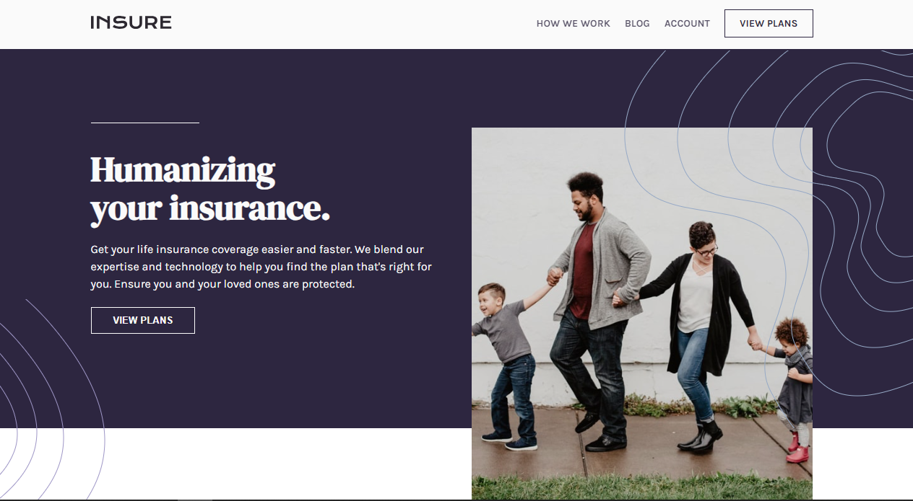

# Frontend Mentor - Insure landing page solution

## Table of contents

- [Overview](#overview)
  - [The challenge](#the-challenge)
  - [Screenshot](#screenshot)
- [My process](#my-process)
  - [Built with](#built-with)
  - [What I learned](#what-i-learned)
  - [Continued development](#continued-development)
  - [Useful resources](#useful-resources)
- [Author](#author)

## Overview

### The challenge

Users should be able to:

- View the optimal layout for the site depending on their device's screen size
- See hover states for all interactive elements on the page

### Screenshot

## My process

### Built with

- Semantic HTML5 markup
- CSS custom properties
- Flexbox
- CSS Grid
- Mobile-first workflow

### What I learned

I really learned a lot building this project especially when it comes to the background pattern part, it was tricky at first but i got the hang of it and it was awesome.

### Continued development

Still animation

### Useful resources

https://angel-rs.github.io/css-color-filter-generator/ A really cool website to change the background-color of your svg using css only. This resources really saved my ass.

## Author

- George Asiedu - [@george5-star](https://www.frontendmentor.io/profile/george5-star)
